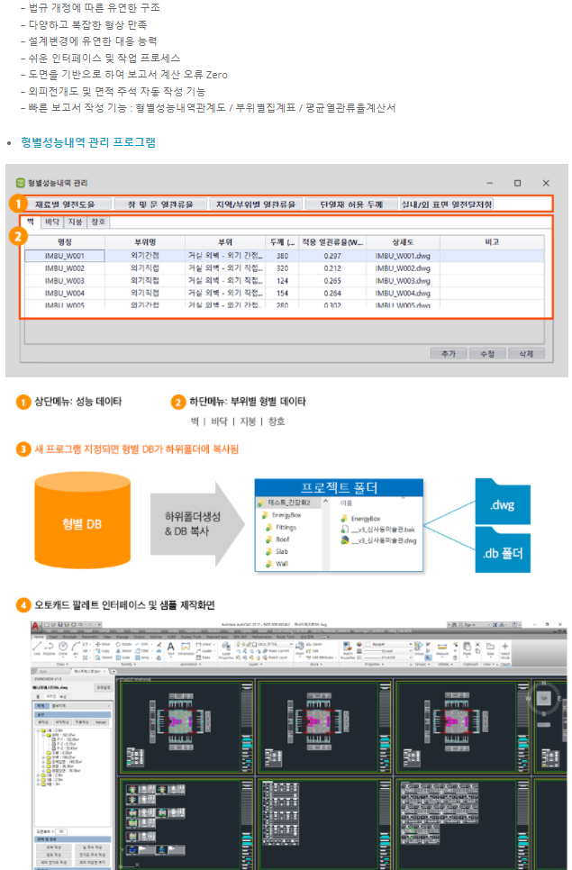
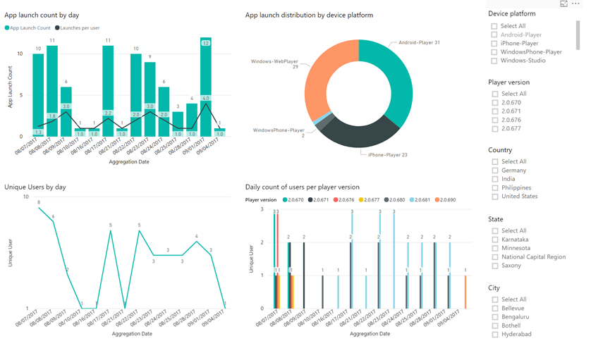
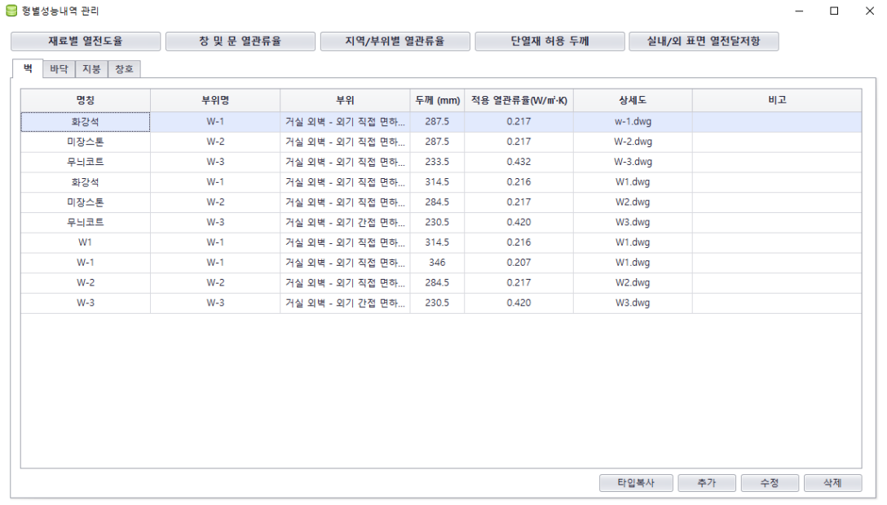
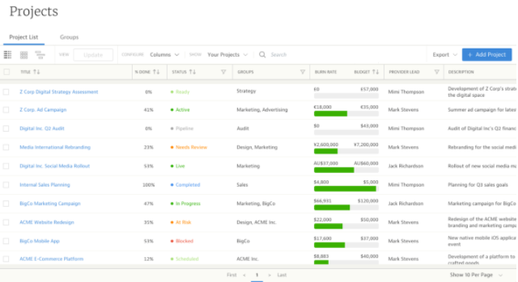
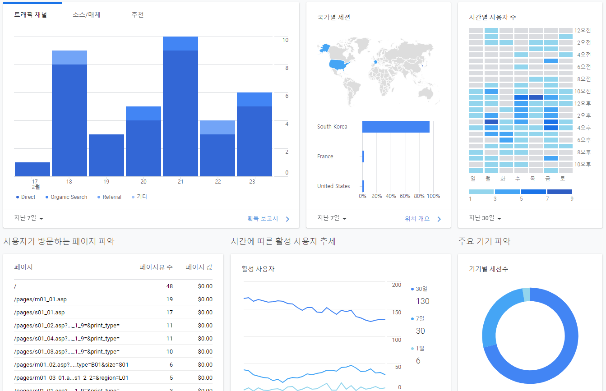
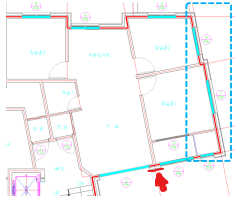
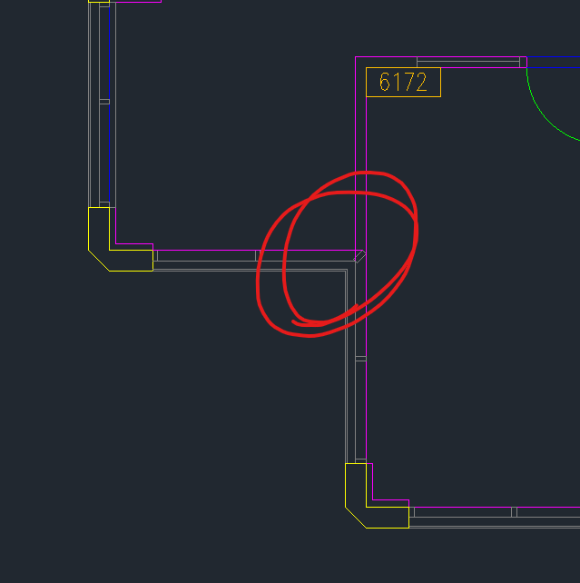
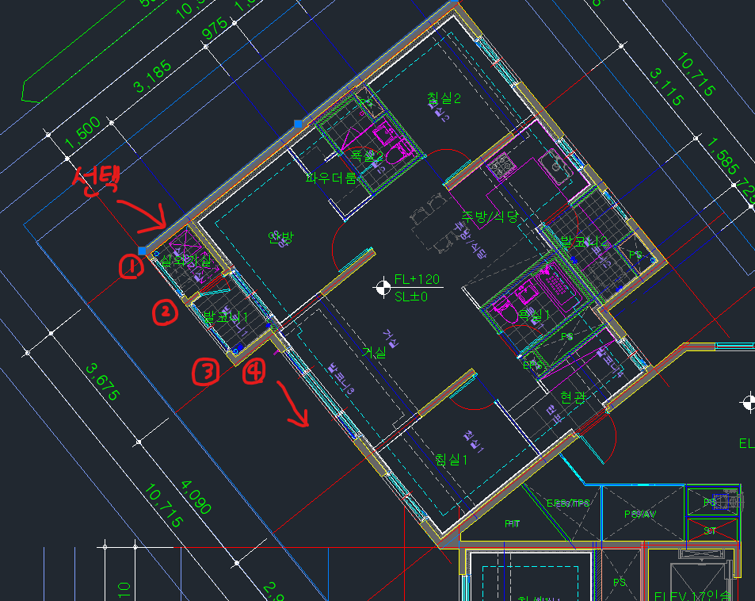

`2022.02.22`

# 분석
## 프로그램범위
### 웹 시스템 (공단 관리)
- 소개 사이트  
  시스템 개요, 기능 소개, 회원가입, 프로그램 다운로드 등을 위한 사이트 구축
  
- 사용자 통계  
  사용자 정보 수집(사전 동의), 전체 사용자 사용현황 통계
  
- 공통데이터관리
  
### 사용자 프로젝트관리
- DWG 프로젝트 목록 관리  
  사용자별 프로젝트 생성, 현황, 도면파일 관리, 열관류율 등 데이터 복사 등
  
- DWG이동, 이름변경 추적
- 데이터수집(to 공단DB)  
  회원가입 후 프로그램 설치시 정보제공 동의, 민감정보 제외 후 데이터 수집
  
### 부재 유형 생성
- 벽, 바닥, 지붕, 창호 유형
- 사용자 기존 프로젝트 유형 복사
### 형별 성능내역 셋팅
- 공단 표준 성능값 조회 및 가져오기
- 프로젝트별, 부재별 셋팅
### 평면작업
- 외벽면 연속벽 자동 탐지  
  외벽선 선택시 동일 레이어선 중 외곽선 자동 탐지하여 작성하며 정보 등록
  
- 창호 위치 자동 탐지  
  레이어, 창호 부호를 참고로 창호 선 자동 작성
- 라인 자동 그리기(벽, 창호)
- 바닥, 지붕 그리기
### 입면 생성
- 벽체, 창호 전개도 그리기
### 성능 내역서, 면적 집계표
- 자동 작성

## 차별점
### 웹 기반 관리 시스템 (공단 관리)
- 공통 데이터 관리 DB 구축
- 웹 기반 DB, 사용자통계 등 관리 기능
### 사용자 별 프로젝트 관리 기능
- 시스템로그인
- 프로젝트관리
- 결과물 조회
### 평면 그리기 작업 자동화
- 외벽선 자동 탐지 기능
- 창호위치 자동 탐지 기능

 

## 평면 그리기
- 아래 방법이 적용될 수 없는 평면도 있음 (코너 창호)
- 평면작성 편의기능 정도로 생각하여야 함

 
`코너평면`

 

### 외벽선 자동탐지 방법
1. 외벽 선 선택  
2. 진행방향 자동 결정
3. 선택한 선의 동일레이어 탐지
4. 다음 위치한 선 선택 및 데이터 저장

 

 

 

## 비용 계산
### 항목
- 웹 시스템 (공단 관리)
- 사용자 프로젝트관리
- 부재 유형 생성
- 형별 성능내역 셋팅
- 평면작업
- 입면 생성
- 성능 내역서, 면적 집계표

### 비용 (만원)
- 6,000 ~ 7,000

 

## 개발 공수
### 항목
- 기획/분석
- 설계
- 개발
- 테스트
- 유지관리

### 공수(안)
- 기획/분석: 3.0MM
- 설계/개발: 10.0MM
- 테스트: 1.0MM