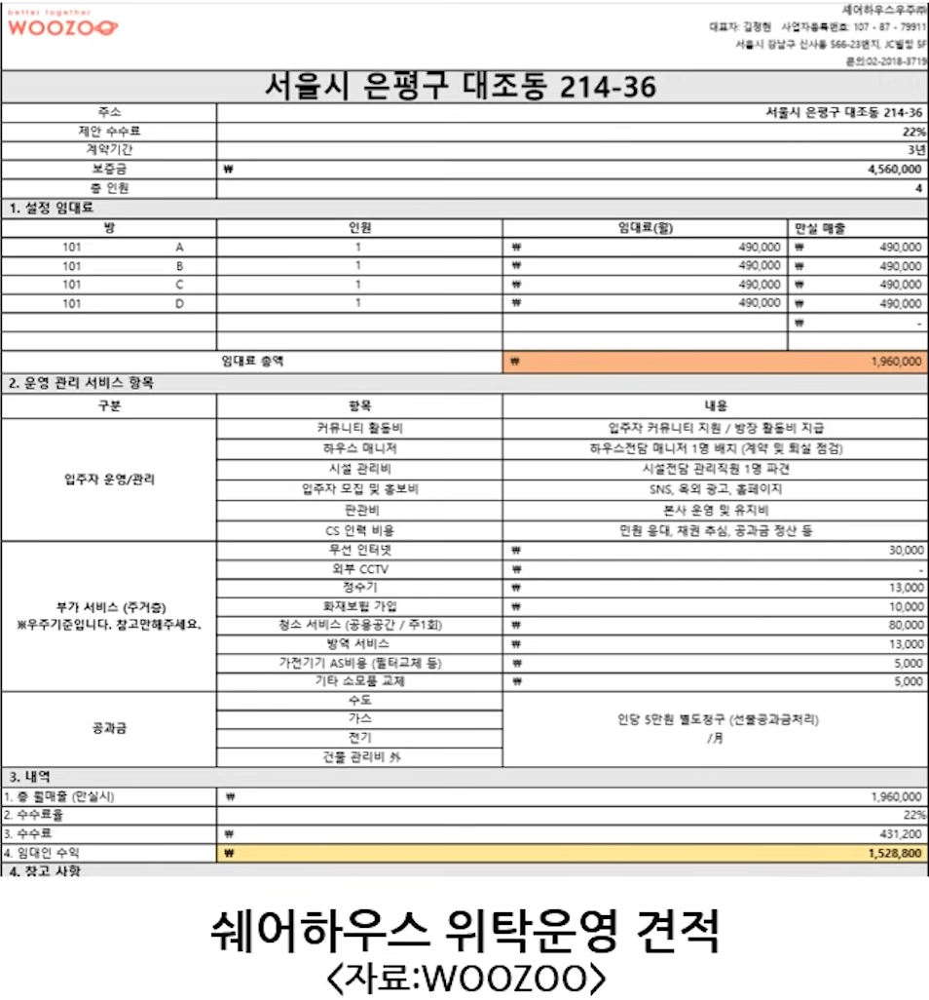
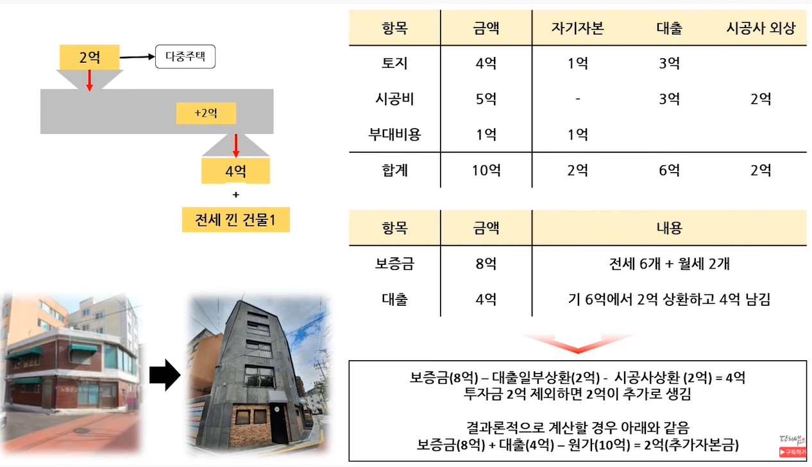

`2022.03.17`

# 서울 은평구 연서로18가길 16-18

## 개요
- 황금대지
- 2019년5월 토지 계약 (4.3억)
- 다중주택
- 4층, 8세대 (2세대 월세, 6세대 전세)

## 히스토리
1. 2층단독주택 계약
2. 리모델링 후 상가 및 쉐어하우스 계획

3. 자본금 묶이는 것 염려
4. 철거 후 다중주택 계획

### 비용

| 항목  | 금액  | 자기자본  | 대출  | 시공사 외상  |
|:---|:---|:---|:---|:---|
| 토지  | 4억  | 1억  | 3억  | -  |
| 시공비  | 5억  | -  | 3억  | 2억  |
| 부대비용  | 1억  | 1억  | -  | -  |
| 합계  | 10억  | 2억  | 6억  | 2억  |

| 토지 | 금액 | 내용 |
|:---|:---|:---:|
| 보증금  | 8억  | 전세6개 + 월세2개  |
| 대출  | 4억  | 기 6억에서 2억 상환하고 4억 남김

